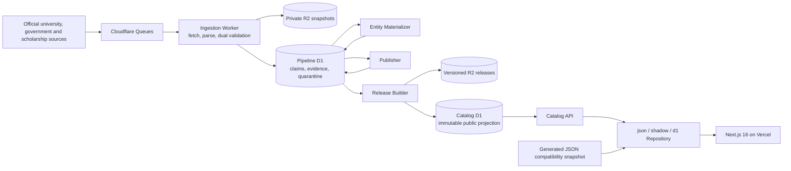
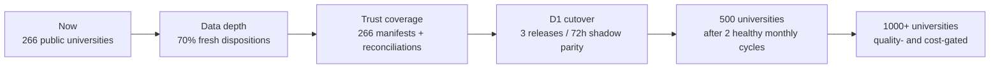

<div align="center">
  
  <h1>Study in China Atlas</h1>
  <p><strong>Source-led discovery for international students exploring Chinese universities, programs, scholarships and study cities.</strong></p>
  <p>
    <a href="https://studyinchina.vercel.app/en"><strong>Explore the live atlas</strong></a>
    · <a href="https://studyinchina.vercel.app/en/programs">Browse programs</a>
    · <a href="https://studyinchina.vercel.app/api/v1/releases/current">Public API</a>
    · <a href="./docs/content-maintenance.md">Data policy</a>
  </p>
  <p>
    <strong>English</strong> · <a href="./README.zh-CN.md">简体中文</a>
  </p>
  <p>
    <a href="https://github.com/computersciencefreshmen/StudyInChina/actions/workflows/ci.yml"></a>
    
    
    
    
    
  </p>
</div>

> [!IMPORTANT]
> Study in China Atlas is an independent, non-commercial public-interest directory—not a university, scholarship provider or application portal. Always confirm deadlines, fees and eligibility on the linked official source before applying or paying.

## Why this atlas exists

International applicants often have to compare hundreds of differently structured university pages, PDF notices and application systems. Study in China Atlas turns those scattered official sources into a searchable, multilingual catalogue while keeping the original evidence one click away.

The product is built around three promises:

| Discover broadly                                                          | Verify precisely                                                           | Understand uncertainty                                                                      |
| ------------------------------------------------------------------------- | -------------------------------------------------------------------------- | ------------------------------------------------------------------------------------------- |
| Explore a national selection instead of a handful of famous universities. | Dynamic facts carry an official source, check date and publication status. | Unknown, conflicting or stale values stay empty; old cycles and guesses never fill the gap. |

## Public identity catalogue snapshot

<div align="center">

| **266** universities | **1,260** program identities | **367** scholarship identities | **62** cities |
| :------------------: | :--------------------------: | :----------------------------: | :-----------: |

</div>

The public identity catalogue contains **39 public admission-cycle records evaluated for 2026-08-25** and is backed by **2,109 registered official source records**. It deliberately retains verified and stale identities as official discovery paths, while the stricter scorecard separately measures evidence freshness and field depth. Only **6** program identities are open, upcoming or rolling on the evaluation date; a public cycle is not automatically an open application window. Reproduce the metrics with `npm run quality:platform-scorecard`.

<details>
<summary><strong>Open the honest data-depth scorecard</strong></summary>

Record count is not the same as record completeness. This stricter scorecard measures fresh, current evidence rather than every public discovery identity:

| Quality indicator                                       |           Current baseline |       Next gate |
| ------------------------------------------------------- | -------------------------: | --------------: |
| Universities below three published programs             | **2** · 1 documented `limited` | 0 unresolved |
| Published identities passing the identity gate          | 1,260 / 1,260 · **100%** |    Maintain 100% |
| Programs with a fresh 30-day disposition                |     39 / 1,260 · **3.10%** |           ≥ 70% |
| Programs with dated or rolling admissions               |     39 / 1,260 · **3.10%** | Report honestly |
| Programs open, upcoming or rolling on the evaluation date |      6 / 1,260 · **0.48%** | Report honestly |
| Programs with duration                                  |    791 / 1,260 · **62.78%** |           ≥ 90% |
| Programs with an official application route             |    656 / 1,260 · **52.06%** |           ≥ 80% |
| Programs with known teaching language                   |  1,073 / 1,260 · **85.16%** |           ≥ 95% |
| Programs with eligibility/language evidence             |      113 / 1,260 · **8.97%** |           ≥ 50% |
| Universities connected to freshly verified scholarships |     206 / 266 · **77.44%** |           ≥ 230 |
| Fresh scholarships with an explicit deadline            |      38 / 349 · **10.89%** | Improve with current cycles |
| Cities with reviewed coordinates                        |                    27 / 62 |         62 / 62 |
| Source Manifests registered                             |                   10 / 266 |       266 / 266 |
| Completed V2 Source Manifests                           |                    0 / 266 |       266 / 266 |
| Complete catalogue reconciliation                       |                    0 / 266 |       266 / 266 |
| Verified records overdue for review                     |                      **0** |               0 |
| Platform quality gates passing                          |                     3 / 14 |         14 / 14 |

The raw compatibility dataset contains 272 universities, 1,280 programs and 394 scholarships. Draft, archived, identity-conflicting or publication-ineligible records are intentionally excluded from the public numbers above.

The public Release API and scorecard agree on the **1,260-program / 367-scholarship identity catalogue**. The scorecard then measures smaller fresh-evidence subsets separately. Never substitute an identity total for current-cycle completeness or open-application availability.

</details>

## Current trust-platform milestone

The current release moves the project from a large static directory toward a measurable decision platform:

- an official decision-facts wave deepens **18 programs across Zhejiang University, Hunan University of Technology and Business, Hangzhou Dianzi University and Guangzhou University**, plus six scholarship records; every captured 2026 deadline is published as closed rather than silently rolled into 2027;
- a second official-depth wave hardens **34 program identities and 11 scholarship identities across GDUFS, SISU, Anhui University, Chongqing University, HIT and XJTU**, with exact scope and freshness semantics carried by idempotent importers;
- five GDUFS official assets now have checksum-addressed private-R2 metadata recorded, while XJTU PDF-dependent facts remain quarantined because the original PDF bytes and browser snapshots were not captured;
- legacy programIds now pass strict relationship validation instead of being silently accepted when a scholarship-to-program link is missing or invalid;
- program cards now render six explicit fact states in English, Chinese, Russian, German, French and Spanish, with visible text and shape markers rather than color alone;
- stale, conflicting, unavailable and historical-cycle values are withheld, while date-free reference tuition is excluded from “known tuition” filters and price sorting;
- registration charges are not relabeled as application fees, and a university-wide tuition range is retained in evidence instead of being converted into a fabricated program-level number;
- quality reporting now separates verified identity, fresh disposition, dated or rolling admissions, and active or upcoming applications;
- the program explorer exposes “Open now” and “Upcoming” as first-level routes, while language switching preserves semantic filters and resets release-bound cursors;
- Favorites loads only requested IDs through a four-program comparison projection instead of serializing the entire catalogue to the browser;
- Release metadata distinguishes raw and public counts, the data-check date, evaluation date, activation time, backend and Vercel deployment SHA;
- ten pilot universities now use strict Source Manifest V2 ledgers in `in_progress` state—none is mislabeled as fully reconciled;
- the `raw-v1` backup format, checksum/readback path and isolated restore procedure have been exercised locally in **101.198 seconds** with zero foreign-key violations; a production RPO/RTO claim waits for dedicated credentials and verified R2 checkpoints;
- Catalog remains on the JSON compatibility backend while D1 Shadow parity, remote credential proof and production rollback evidence remain explicit cutover gates.

This milestone deliberately exposes the freshness gap while preserving catalogue continuity: a confirmed identity can remain discoverable, but stale deadlines, fees, requirements, funding and application routes are withheld. Freshness metrics therefore fall honestly without breaking stable discovery links or presenting expired facts as current.

### Operational status: implemented versus proven

| Surface           | Current state                                                                                               | Deliberately not claimed yet                                                                     |
| ----------------- | ----------------------------------------------------------------------------------------------------------- | ------------------------------------------------------------------------------------------------ |
| Public catalogue  | Vercel serves the generated JSON compatibility snapshot with publication gates and official-source links.   | That Catalog D1 is the production read path.                                                     |
| Data platform     | Pipeline/Catalog D1 schemas, Workers, versioned releases and Shadow comparison are implemented.             | Three matching releases over 72 hours with zero critical Shadow differences.                     |
| Recovery          | `raw-v1` export, checksum/readback validation and isolated restore are implemented and locally exercised.   | A live 7/7 backup record, a measured production RPO/RTO, or a completed remote restore drill.    |
| Stable deployment | Production promotion is designed to require an exact main SHA, successful CI and a stable-alias smoke test. | An automatic-promotion guarantee before the dedicated GitHub secret is configured and exercised. |

This distinction is intentional: implementation, local verification and production evidence are different stages of an operational claim.

## What applicants can do

- Browse universities, programs, scholarships and student cities in one coherent interface.
- Explore programs through a 17-field, applicant-oriented taxonomy, including Chinese language and international Chinese education.
- Share URL-based filters, sorting and pagination; remove active filters individually and preserve browser history.
- Move from application state and deadline to fees, language and duration through decision-first cards and detail-page application snapshots.
- Narrow programs to records with an explicit university or program scholarship relationship without claiming applicant-specific eligibility.
- Explore cities through a geographic constellation or an accessible searchable directory, then use flagship guides with official sources, FAQs and stable section links.
- Keep identity-only records available for official discovery while excluding thin pages from search-engine indexing until they meet deterministic completeness gates.
- Save records locally, compare up to four programs and print a compact comparison sheet.
- Inspect field-level source links, last-check dates and uncertainty states.
- Use English, Chinese and Russian public routes; German, French and Spanish are the first reviewed expansion routes.
- Move from discovery to the official university or scholarship application system—the atlas never receives application documents.

Portuguese and Arabic remain registered preview locales and are not publicly indexed. When translated record prose is unavailable, the interface uses an explicit English fallback rather than presenting machine output as an official translation.

## Trust model: evidence before completeness

The catalogue separates **record identity** from **field visibility**. A verified program identity may remain discoverable even when its tuition or deadline cannot safely be shown. The public fact contract supports six explicit states; program cards now apply them to duration, tuition, deadline and application fee:

```ts
type FactStatus =
  | "known"
  | "officially_not_announced"
  | "not_applicable"
  | "source_unavailable"
  | "conflict"
  | "stale";
```

These states are now visible on program cards in six languages. Stale and reference-only values cannot surface there as current tuition, deadline, duration or application-fee facts, while the official route remains available for final verification. Detail and comparison surfaces will adopt the same contract incrementally.

Publication follows these rules:

1. Only allowlisted university, government and scholarship-provider sources can support a fact.
2. Every changing fact belongs to a specific academic year and intake.
3. Deterministic parsing extracts links, dates, money and page structure before model-assisted extraction.
4. High-risk fields require two independent MiniMax extractions to agree and point to locatable evidence.
5. Evidence, deterministic rules, freshness and cross-source conflict checks must all pass.
6. A failed field is published as an empty value with status metadata and an official entry link—not as a guess.
7. Immutable releases are relationship-, count- and hash-validated before the public pointer moves atomically.

When captured by the ingestion pipeline, raw HTML, PDFs and screenshots are kept private in R2. The public platform exposes only validated structured facts and the shortest necessary source context; source registration alone does not imply that every asset already has a stored snapshot.

## System architecture



### Why the platform is split this way

| Layer              | Responsibility                                                         | Engineering reason                                                                           |
| ------------------ | ---------------------------------------------------------------------- | -------------------------------------------------------------------------------------------- |
| Pipeline D1        | Jobs, candidates, evidence, conflicts and quarantine                   | Frequent internal writes never compete with public reads.                                    |
| Private R2         | Compressed source snapshots, PDFs, evidence assets and release exports | Cheap immutable storage makes audit and recovery possible.                                   |
| Catalog D1         | Validated, versioned public projection                                 | The website reads a stable release instead of half-written ingestion state.                  |
| Catalog Repository | `json`, `shadow` and `d1` backends                                     | The application can compare backends and roll back without rewriting pages.                  |
| Next.js on Vercel  | Multilingual pages, SEO, feedback and web delivery                     | App Router provides server rendering while Vercel supplies previews and production delivery. |

The platform foundation is implemented, but production remains deliberately compatible with the generated JSON repository while D1 shadow comparison and release-readiness gates continue. MiniMax credentials exist only as Cloudflare secrets; source content never receives database, network or execution privileges.

## Technology map

| Concern           | Choice                                                               |
| ----------------- | -------------------------------------------------------------------- |
| Web application   | Next.js 16 App Router, React 19, strict TypeScript 5.9               |
| Design system     | Accessible custom “academic atlas” CSS, progressive enhancement      |
| Collection        | Cloudflare Workers, Queues, allowlisted fetch policies               |
| Data and evidence | Pipeline D1, Catalog D1, private R2, immutable releases              |
| Extraction        | Deterministic parsers + MiniMax dual extraction + evidence grounding |
| Validation        | Zod schemas, deterministic conflict/freshness/publication gates      |
| Testing           | Vitest 4, Testing Library, Node test runner, Playwright              |
| Delivery          | GitHub Actions, Vercel Preview and Production deployments            |
| Observability     | Release age, queue/DLQ state, source health, backup and cost signals |

## Public API

Versioned endpoints use cursor pagination. List endpoints default to `limit=24` and accept at most 100 records per request.

| Endpoint                                 | Purpose                                                    |
| ---------------------------------------- | ---------------------------------------------------------- |
| `GET /api/v1/institutions`               | Search and filter institutions                             |
| `GET /api/v1/institutions/{slug}`        | Institution detail                                         |
| `GET /api/v1/programs`                   | Search and filter programs                                 |
| `GET /api/v1/programs/{slug}`            | Program detail                                             |
| `GET /api/v1/programs/{slug}/cycles`     | Program admission cycles                                   |
| `GET /api/v1/programs/compare?ids=...`   | Lightweight comparison projection for one to four programs |
| `GET /api/v1/scholarships`               | Search and filter scholarships                             |
| `GET /api/v1/scholarships/{slug}/cycles` | Scholarship cycles                                         |
| `GET /api/v1/releases/current`           | Current public release metadata                            |
| `GET /api/v1/double-first-class`         | Double First-Class coverage view                           |

```bash
curl "https://studyinchina.vercel.app/api/v1/institutions?discipline=chinese-language&limit=3"
```

Program filtering supports institution, city, program type, degree, field, teaching language, academic year, intake, tuition range, application state and scholarship availability.

`GET /api/v1/releases/current` keeps release identity separate from website deployment identity: it returns raw and public counts, `dataCheckedThrough`, `evaluatedForDate`, `activatedAt`, `catalogBackend` and, when available, the Vercel deployment SHA.

## Run locally

The default JSON backend works without Cloudflare credentials, so a contributor can inspect the product safely before configuring infrastructure.

```bash
git clone https://github.com/computersciencefreshmen/StudyInChina.git
cd StudyInChina
npm ci
cp .env.example .env.local
npm run dev
```

PowerShell equivalent:

```powershell
Copy-Item .env.example .env.local
npm run dev
```

Open <http://localhost:3000>. The root route redirects to the saved or browser-preferred public locale.

Set `CONTENT_PREVIEW=true` only in local development or a Vercel Preview when you intentionally need to inspect draft content. Production ignores that switch. The feedback endpoint fails closed when Turnstile, distributed rate limiting or email delivery is missing.

## Quality gates

Every code change is expected to pass the core local gate:

```bash
npm run lint
npm run typecheck
npm test
npm run validate:data
npm run validate:d1
npm run validate:manifests
npm run quality:platform-scorecard
npm run build
npm run test:e2e
```

CI additionally validates Source Manifests, prompt-injection fixtures, maintenance capacity, all Worker test suites and Worker deployment dry-runs. The complete executable matrix lives in [`.github/workflows/ci.yml`](./.github/workflows/ci.yml).

Data changes must satisfy a stricter rule: an increase in row count is not progress unless source coverage, fresh disposition, dated-or-rolling and active-upcoming evidence, field completeness and update success improve with it.

## Repository map

```text
.github/workflows/                 CI, source checks, backups and deployments
content/data/                      generated JSON compatibility snapshot
content/source-manifests/          allowlisted official-source manifests
docs/                              architecture, operations and data policies
infra/d1/                          Pipeline and Catalog D1 migrations
scripts/catalog/                   release building and performance benchmarks
scripts/ingestion/                 manifest, source and materialization tooling
scripts/quality/                   coverage, inventory and platform scorecards
src/app/[locale]/                  localized App Router pages
src/app/api/v1/                    versioned public API compatibility routes
src/components/                    design system and product features
src/i18n/                          locale registry and reviewed interface copy
src/lib/catalog/                   json / shadow / d1 repository implementations
src/lib/data/                      schemas, publication gates and formatting
tests/unit/                        domain, API and browser-storage tests
tests/e2e/                         multilingual critical-path tests
workers/ingestion/                 fetch, snapshot, parse and extraction pipeline
workers/entity-materializer/       candidate-to-entity field mapping
workers/publisher/                 validated publication candidates
workers/release-builder/           immutable release assembly and cutover
workers/catalog-api/               public D1 API Worker
workers/localization/              gated translation pipeline (disabled by default)
```

## Release, rollback and recovery

- `main` is the production code branch; every pull request receives a Vercel Preview.
- A catalogue release is immutable and moves live only after schema, relationship, count, search and checksum validation.
- Catalog D1 retains the active release and two rollback releases; full history remains in private R2.
- A data rollback moves `currentReleaseId` back to a validated release without redeploying the application.
- An application rollback promotes the previous healthy Vercel deployment.
- Once the dedicated backup credentials are configured, daily exports target a 24-hour recovery point; recovery restores into an isolated database before any production cutover.

See [`docs/platform-rollout.md`](./docs/platform-rollout.md), [`docs/backup-and-restore.md`](./docs/backup-and-restore.md) and [`docs/database-schema.md`](./docs/database-schema.md) for operational detail.

## Roadmap: depth before uncontrolled scale



Near-term work is measured by:

- raising Hunan University of Technology and Business from two to at least three official international-student programs, while retaining Tibet University as a documented `limited` catalogue unless another individually applicable official program is found; Zhejiang University now has six decision-ready identities in this wave;
- increasing fresh-disposition coverage from 3.10% to at least 70%, without counting date-free fee references as application cycles;
- moving from the measured baselines of 62.78% duration, 52.06% official application-route, 85.16% teaching-language and 8.97% requirements coverage to the six-week gates of 75% / 65% / 90% / 25%;
- continuing after that toward the expansion gates of 90% duration, 80% application-route, 95% teaching-language and 50% requirements coverage;
- expanding institutions connected to freshly verified scholarships from 206 to at least 230;
- completing 266 Source Manifests and 266 catalogue reconciliations;
- completing three matching shadow releases over at least 72 hours before Production switches to D1;
- passing two full monthly update cycles before expansion to 500, then 1,000+ institutions.

## Contributing data safely

Corrections and additions are welcome when they strengthen evidence quality.

1. Provide an official HTTPS URL from the university, government or scholarship provider.
2. Identify the academic year and intake for any deadline, fee or requirement.
3. Include the date on which the source was checked.
4. Leave unannounced values empty; do not infer them from an earlier year.
5. Never use a ranking, agency or aggregator as the sole evidence for an admissions fact.
6. Never commit passports, transcripts, health records, applicant emails or other personal application data.
7. Run lint, typecheck, tests and data validation before opening a pull request.

Use the [data-correction issue form](./.github/ISSUE_TEMPLATE/data-correction.yml) or follow the [pull-request template](./.github/pull_request_template.md). Raw collection artifacts and candidate packages belong in the private pipeline/quarantine flow, not in the public catalogue.

## Security and privacy boundaries

- Collection is limited to registered official HTTPS domains and respects access controls, robots policies and per-domain throttling.
- The platform does not bypass authentication, CAPTCHAs, `403` responses, regional restrictions or private endpoints.
- Fetch validation rejects private-network addresses, unusual ports and unregistered cross-domain redirects.
- Applicants do not create accounts and the project does not collect application documents.
- Favorites and comparison state remain in the browser.
- Feedback is protected with origin checks, Turnstile, HMAC-based rate limiting and private email delivery.

Report a security problem privately to the maintainer rather than placing secrets or exploit details in a public issue.

## Creator

Created and maintained by [Henry Yang](https://yanghanyu2023.wixsite.com/henry) as a non-commercial public-interest information project for international students.

If you spot outdated information, use the website’s private correction form and include the official source. Please never send passports, transcripts, medical records or payment information.
