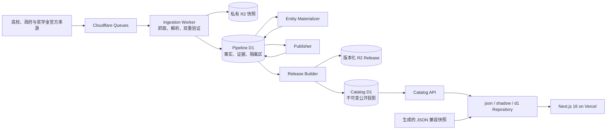
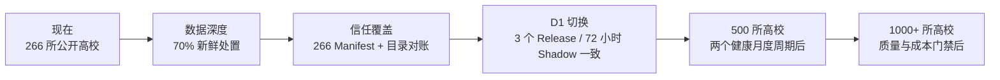

<div align="center">
  
  <h1>Study in China Atlas</h1>
  <p><strong>面向国际学生的中国高校、项目、奖学金与留学城市的官方来源导向目录。</strong></p>
  <p>
    <a href="https://studyinchina.vercel.app/zh"><strong>访问在线图谱</strong></a>
    · <a href="https://studyinchina.vercel.app/zh/programs">浏览项目</a>
    · <a href="https://studyinchina.vercel.app/api/v1/releases/current">公开 API</a>
    · <a href="./README.md">English README</a>
    · <a href="./docs/content-maintenance.md">数据政策</a>
  </p>
  <p>
    <a href="https://github.com/computersciencefreshmen/StudyInChina/actions/workflows/ci.yml"></a>
    
    
    
    
    
  </p>
</div>

> [!IMPORTANT]
> Study in China Atlas 是独立、非商业、公益性质的信息目录，不是高校、奖学金资助方或申请平台。申请或缴费前，务必在本项目链接的官方来源中再次核实截止日期、费用与资格条件。

> [!NOTE]
> 本文件是 [English README](./README.md) 的中文说明。若中英文文案与可执行校验结果不一致，以仓库中的数据校验、源文件与官方来源为准。

## 为什么要做这个图谱

国际申请者通常要在数百个结构各异的高校页面、PDF 招生简章和申请系统之间反复比对。Study in China Atlas 将这些分散的官方入口整理为可检索、多语言的目录，同时让原始官方证据始终保持一键可达。

它围绕三个承诺设计：

| 广泛发现                                               | 精确核验                                             | 明确不确定性                                                   |
| ------------------------------------------------------ | ---------------------------------------------------- | -------------------------------------------------------------- |
| 先让用户看到全国范围的选择，而不是只看到少数知名高校。 | 每项动态事实都尽量绑定官方来源、检查日期与发布状态。 | 未知、冲突或过期的值保持为空；旧学年和推测不会补成“完整信息”。 |

这是一项数据基础设施工程，而不只是一个网页目录：前台负责帮助申请者理解和比较；采集、证据、校验、发布与回滚链路负责让信息可以持续维护。

## 当前公开身份目录快照

公开 API 的身份目录与本地真实执行的 `npm run quality:platform-scorecard` 使用不同且互补的口径，评估日期均为 **2026-08-17**：前者保留可发现的已核验或 `stale` 身份，后者只统计当前新鲜证据。两者都不等同于“所有字段都完整”或“所有项目都正在开放申请”。

<div align="center">

| **266** 所高校 | **1,234** 个项目身份 | **360** 项奖学金身份 | **62** 座城市 |
| :------------: | :------------------: | :------------------: | :-----------: |

</div>

当前公开身份目录包含 **52** 条招生周期或学费参考记录。它保留可发现的已核验或 `stale` 身份；下方质量分数卡则只统计当前新鲜证据。目录背后登记了官方来源与证据管线；但只有完成发布门禁的字段才会显示为具体值。项目身份、当前招生动态、费用、要求和奖学金资格是不同层次的数据，不能用一条总数混为一谈。

### 数据质量口径：先诚实，再扩张

行数不是数据深度。下方更严格的分数卡只衡量当前新鲜证据，而不是所有公开发现身份：

| 指标                               |                   当前基线 |                        近期目标 |
| ---------------------------------- | -------------------------: | ------------------------------: |
| 少于 3 个公开项目的高校            |                   **8** 所 | 0 所，或完成 `limited` 目录对账 |
| 当前新鲜核验的国际生项目身份       | 1,233 / 1,234 · **99.92%** |                     恢复至 100% |
| 30 天内有新鲜处置结论的项目        |     49 / 1,233 · **3.97%** |                           ≥ 70% |
| 有明确日期或滚动招生语义的项目     |     49 / 1,233 · **3.97%** |          如实报告，不用猜测补齐 |
| 评估日处于开放或即将开放状态的项目 |     10 / 1,233 · **0.81%** |        如实报告，不用旧日期抬高 |
| 已知学制的项目                     |   760 / 1,233 · **61.64%** |                           ≥ 90% |
| 有官方申请入口的项目               |   627 / 1,233 · **50.85%** |                           ≥ 80% |
| 已知授课语言的项目                 | 1,049 / 1,233 · **85.08%** |                           ≥ 95% |
| 有资格或语言要求证据的项目         |     76 / 1,233 · **6.16%** |                           ≥ 50% |
| 关联至少一项新鲜核验奖学金的高校   |     204 / 266 · **76.69%** |                        ≥ 230 所 |
| 有已审阅坐标的城市                 |       27 / 62 · **43.55%** |                         62 / 62 |
| 已登记 Source Manifest 的高校      |       10 / 266 · **3.76%** |                       266 / 266 |
| 完成 V2 Manifest 的高校            |                    0 / 266 |                       266 / 266 |
| 完成目录对账的高校                 |                    0 / 266 |                       266 / 266 |
| 通过的平台质量门禁                 |                 **3 / 14** |                         14 / 14 |

补充说明：当前有 **42 / 350（12%）** 奖学金记录带明确截止日；已过复核期的已核验记录为 **0**。一旦超过复核期，记录会降为 `stale`，而不是被包装成“高完整度”。`published` 且完全没有日期的招生周期记录为 **0**。

原始兼容数据集、草稿、归档记录、身份冲突记录或尚不满足公开条件的候选，会被有意排除在上述公开数字之外。数据少于预期时，优先意味着系统在拒绝猜测，而不是把空白伪装成事实。

公开 Release API 返回的是更宽的 **1,234** 个项目身份和 **360** 项奖学金身份；分数卡则有意返回较小的当前新鲜核验子集。两种指标都必须保留，不能互相替换。

## 申请者现在可以做什么

- 在高校、项目、奖学金和留学城市之间连续浏览，而不是在不同站点之间反复跳转。
- 通过 17 类申请者导向的学科体系查找项目，其中包括汉语学习与国际中文教育。
- 使用写入 URL 的筛选、排序和分页，便于分享、刷新、前进与后退；可逐项清除筛选条件。
- 从申请状态与截止日期继续查看学费、授课语言、学制和详情页的申请信息概览。
- 筛选有明确高校或项目奖学金关联的项目，但不会声称用户一定符合奖学金资格。
- 以星图或无障碍可搜索目录探索城市，再进入含官方来源、FAQ 与稳定锚点的指南。
- 保留“仅有项目身份”的官方发现入口，同时在达到确定性完整度门槛前，将薄内容页面移出搜索引擎索引。
- 在浏览器本地收藏记录；最多比较四个项目，并打印紧凑的对比页面。
- 查看字段级官方来源、最近检查时间与不确定性状态。
- 使用中文、英文和俄文公开路由；德文、法文和西文处于首批受审阅扩展范围。
- 从目录跳转到学校或奖学金官方申请系统；本项目不接收申请材料。

葡萄牙语和阿拉伯语目前只作为注册预览语言，并未公开索引。当没有经过审阅的记录译文时，界面明确回退到英文，不会把机器输出表述为官方翻译。

## 信任模型：证据先于“看起来完整”

平台把**记录身份**与**字段可见性**分开管理。一个已确认面向国际生的项目，即使其学费或截止日期当前不能安全展示，也可以作为官方发现入口被保留。每个动态字段都使用六种明确状态之一：

```ts
type FactStatus =
  | "known"
  | "officially_not_announced"
  | "not_applicable"
  | "source_unavailable"
  | "conflict"
  | "stale";
```

发布规则如下：

1. 只有进入白名单的高校、政府或奖学金机构官方来源可以支撑事实。
2. 每项会变化的事实都属于特定学年与入学季。
3. 规则解析先提取链接、日期、金额和页面结构，再进入模型辅助抽取。
4. 高风险字段需要两次彼此独立的 MiniMax 抽取结果一致，并能定位到原文证据。
5. 证据定位、确定性规则、新鲜度与跨来源冲突检查必须全部通过。
6. 字段未通过时，公开值为空，并保留状态元数据与官方入口；绝不补写猜测值。
7. 不可变 Release 在公开指针原子切换前，会校验关系、数量、搜索结果和哈希。

原始 HTML、PDF 与截图保存在私有 R2。公开平台只展示结构化事实及最短必要的来源上下文，不公开镜像原始材料。

### 四层招生动态指标

“当前招生周期覆盖率”很容易被误读，因此系统采用四层口径：

| 指标                       | 含义                                                            |
| -------------------------- | --------------------------------------------------------------- |
| `identityCoverage`         | 已确认项目身份，且面向国际生公开发现。                          |
| `freshDispositionCoverage` | 30 天内已明确核对为已公布、滚动招生、未公布、来源不可用或冲突。 |
| `datedOrRollingCoverage`   | 有实际日期，或官方明确为滚动招生。                              |
| `activeUpcomingCoverage`   | 在评估日期当日处于开放、即将开放或滚动状态。                    |

无日期的学费参考不得被计入可行动招生周期。这样做会让数值在过期审计后下降，但能防止用户被历史招生信息误导。

## 系统架构



### 为什么要拆成这些层

| 层                 | 职责                                   | 工程上的原因                                           |
| ------------------ | -------------------------------------- | ------------------------------------------------------ |
| Pipeline D1        | 抓取任务、候选、证据、冲突与隔离       | 内部高频写入不会与公开查询互相争抢资源。               |
| 私有 R2            | 压缩快照、PDF、证据资产与 Release 导出 | 低成本的不可变存储让审计与恢复有基础。                 |
| Catalog D1         | 已验证、版本化的公开投影               | 网站读取稳定版本，不会读到采集过程中的半成品。         |
| Catalog Repository | `json`、`shadow` 与 `d1` 三种后端      | 可比较后端、可审计差异，也可在不重写页面的前提下回退。 |
| Next.js + Vercel   | 多语言页面、SEO、纠错入口与交付        | App Router 提供服务端渲染，Vercel 提供预览与生产交付。 |

这套数据平台基础已经实现，但生产读取仍有意保留在生成的 JSON 兼容后端，直到 D1 Shadow 对比、凭据配置和回滚证据全部满足切换门槛。MiniMax 密钥仅以 Cloudflare Secret 形式保存；来源页面内容没有数据库、网络或执行权限。

## 技术地图

| 关注点     | 选择                                                   |
| ---------- | ------------------------------------------------------ |
| Web 应用   | Next.js 16 App Router、React 19、严格 TypeScript 5.9   |
| 设计系统   | 可访问的定制化“学术图谱”CSS 与渐进增强                 |
| 采集       | Cloudflare Workers、Queues、白名单抓取策略             |
| 数据与证据 | Pipeline D1、Catalog D1、私有 R2、不可变 Release       |
| 抽取       | 确定性解析器 + MiniMax 双重独立抽取 + 证据锚定         |
| 校验       | Zod Schema、确定性冲突/新鲜度/发布门禁                 |
| 测试       | Vitest 4、Testing Library、Node 测试运行器、Playwright |
| 交付       | GitHub Actions、Vercel Preview 与 Production 部署      |
| 可观测性   | Release 年龄、队列/DLQ、来源健康、备份与成本信号       |

## 公开 API

API 采用版本化路径与游标分页。列表接口默认 `limit=24`，单次最多请求 100 条。

| 接口                                     | 用途                       |
| ---------------------------------------- | -------------------------- |
| `GET /api/v1/institutions`               | 搜索与筛选高校             |
| `GET /api/v1/institutions/{slug}`        | 高校详情                   |
| `GET /api/v1/programs`                   | 搜索与筛选项目             |
| `GET /api/v1/programs/{slug}`            | 项目详情                   |
| `GET /api/v1/programs/{slug}/cycles`     | 项目招生周期               |
| `GET /api/v1/programs/compare?ids=...`   | 最多四个项目的轻量对比投影 |
| `GET /api/v1/scholarships`               | 搜索与筛选奖学金           |
| `GET /api/v1/scholarships/{slug}/cycles` | 奖学金年度周期             |
| `GET /api/v1/releases/current`           | 当前公开 Release 元数据    |
| `GET /api/v1/double-first-class`         | 双一流覆盖视图             |

```bash
curl "https://studyinchina.vercel.app/api/v1/institutions?discipline=chinese-language&limit=3"
```

项目筛选支持高校、城市、项目类型、学历、学科、授课语言、学年、入学季、学费区间、申请状态与奖学金可用性。字段级响应会保留相应状态和可定位的最短证据；客户端不需要下载完整目录再自行筛选。

## 本地运行

默认 JSON 后端不需要 Cloudflare 凭据，因此贡献者可以先安全地查看产品，再配置数据基础设施。

```bash
git clone https://github.com/computersciencefreshmen/StudyInChina.git
cd StudyInChina
npm ci
cp .env.example .env.local
npm run dev
```

PowerShell：

```powershell
Copy-Item .env.example .env.local
npm run dev
```

打开 <http://localhost:3000>。根路由会跳转到保存的语言偏好或浏览器偏好的公开语言。

仅在本地开发或明确需要查看草稿内容的 Vercel Preview 中设置 `CONTENT_PREVIEW=true`。生产环境会忽略该开关。若缺少 Turnstile、分布式限流或邮件投递配置，纠错反馈接口会保持 fail-closed（拒绝处理），而不是在没有保护的情况下接收数据。

## 本地验证与质量门禁

每次代码或受控数据变更，至少应通过以下核心门禁：

```bash
npm run lint
npm run typecheck
npm test
npm run validate:data
npm run validate:d1
npm run validate:manifests
npm run quality:platform-scorecard
npm run build
npm run test:e2e
```

CI 还会验证 Source Manifest、提示注入夹具、维护容量、所有 Worker 测试与 Worker 部署 dry-run。完整、可执行的矩阵见 [`.github/workflows/ci.yml`](./.github/workflows/ci.yml)。

数据变更遵守更严格的准则：若来源覆盖、周期新鲜度、字段完整度和更新成功率没有改善，单纯增加行数不算进展。严禁用国内生项目、历史费用或未核验摘要填补国际生项目空白。

## 仓库地图

```text
.github/workflows/                 CI、来源检查、备份与部署
content/data/                      生成的 JSON 兼容快照
content/source-manifests/          白名单官方来源 Manifest
docs/                              架构、运维和数据政策
infra/d1/                          Pipeline 与 Catalog D1 migration
scripts/catalog/                   Release 构建与性能基准
scripts/ingestion/                 Manifest、来源与实体化工具
scripts/quality/                   覆盖率、资产清单与平台分数卡
src/app/[locale]/                  本地化 App Router 页面
src/app/api/v1/                    版本化公开 API 兼容路由
src/components/                    设计系统与产品功能
src/i18n/                          locale 注册表与受审阅界面文案
src/lib/catalog/                   json / shadow / d1 repository 实现
src/lib/data/                      Schema、发布门禁与格式化
tests/unit/                        领域、API 与浏览器存储测试
tests/e2e/                         多语言关键路径测试
workers/ingestion/                 抓取、快照、解析与抽取管线
workers/entity-materializer/       候选到实体的字段映射
workers/publisher/                 已验证发布候选
workers/release-builder/           不可变 Release 组装与切换
workers/catalog-api/               公开 D1 API Worker
workers/localization/              受门禁的翻译管线（默认关闭）
```

## 发布、回滚与恢复

- `main` 是生产代码分支；每个 Pull Request 获得 Vercel Preview。
- 目录 Release 不可变，只有通过 schema、关系、计数、搜索与校验和验证后才可以移动公开指针。
- Catalog D1 设计上保留当前 Release 与两个可回滚 Release；完整历史保留在私有 R2。
- 数据回滚通过将 `currentReleaseId` 指回已验证 Release 完成，不需要重新部署应用。
- 应用回滚通过提升前一个健康的 Vercel 部署完成。
- 每日导出的目标恢复点为 24 小时；任何恢复都应先在隔离数据库中验证，再考虑生产切换。

### 当前运行状态：已实现与已证明

| 范围     | 当前状态                                                             | 尚不宣称的结论                                             |
| -------- | -------------------------------------------------------------------- | ---------------------------------------------------------- |
| 公开目录 | Vercel 正在提供带发布门禁和官方来源链接的生成 JSON 兼容快照。        | Catalog D1 已成为生产读取路径。                            |
| 数据平台 | Pipeline/Catalog D1、Worker、版本化 Release 与 Shadow 对比均已实现。 | 已在 72 小时内完成 3 个无关键差异的 Shadow Release。       |
| 恢复能力 | `raw-v1` 导出、校验和/读回校验与隔离恢复均已实现，并完成本地演练。   | 连续 7/7 的生产备份记录、实测生产 RPO/RTO 或远端恢复演练。 |
| 稳定部署 | 推广流程设计为要求精确 `main` SHA、成功 CI 与稳定域烟测。            | 在专用 GitHub Secret 配置并实际演练前，自动推广一定可用。  |

这种区分是刻意的：代码实现、本地验证和生产运行证据属于不同阶段，不能混为一谈。

运维细节见 [`docs/platform-rollout.md`](./docs/platform-rollout.md)、[`docs/backup-and-restore.md`](./docs/backup-and-restore.md) 与 [`docs/database-schema.md`](./docs/database-schema.md)。这些文档描述目标流程与已实现组件；生产切换必须以实际的 Shadow、备份、恢复和回滚证据为准。

## 路线图：深度优先于无门槛扩张



近期工作以以下可测量目标衡量：

- 将剩余 8 所稀疏高校提升到 3–5 个可核实的国际生项目；若官方目录确实有限，则完成带证据的 `limited` 对账，而不制造空壳记录。
- 将新鲜处置覆盖率从 3.97% 提升到至少 70%，不把无日期学费参考计为招生周期。
- 先达到六周门槛：75% 学制、65% 官方申请入口、90% 授课语言、25% 要求信息；再向 90% / 80% / 95% / 50% 的扩展门槛推进。
- 将奖学金关联高校从 204 所提升到至少 230 所，并补充真实年度、资助类型、适用范围和截止日期证据。
- 完成 266 份 Source Manifest 与 266 份目录对账；仅“发现了来源”不能被称作“完整对账”。
- 在 Production 读取 D1 前，连续完成 3 个一致的 Shadow Release，并跨越至少 72 小时。
- 在扩展到 500 所、再到 1,000+ 所之前，先通过两个完整的月度更新周期、抓取成功率、积压、准确率与成本门禁。

当前不会为了数字增长直接扩展到 500 所。用户需要的是能核验、能比较、能维护的信息，不是没有申请入口和证据的项目名堆积。

## 安全地贡献数据

欢迎能够提高证据质量的纠错与补充。请遵循以下原则：

1. 提供高校、政府或奖学金资助方的官方 HTTPS URL。
2. 对每一个截止日期、费用或要求，注明学年和入学季。
3. 写明检查来源的日期。
4. 未公布的值保持为空；不要根据上一学年推断新一年的值。
5. 排名、留学中介或聚合网站不能作为招生事实的唯一证据。
6. 不要提交护照、成绩单、健康记录、申请人邮箱或其他个人申请数据。
7. 发起 Pull Request 前运行 lint、typecheck、测试与数据校验。

请使用[数据纠错 issue 表单](./.github/ISSUE_TEMPLATE/data-correction.yml)，或遵循 [Pull Request 模板](./.github/pull_request_template.md)。原始采集材料、模型候选包与隔离资产应进入私有 pipeline/quarantine 流程，不应直接写入公开目录或用 `git add .` 一次性提交。

## 安全与隐私边界

- 采集仅限登记过的官方 HTTPS 域名，并遵守访问控制、robots 政策与每域限速。
- 平台不会绕过登录、验证码、`403`、地区限制或私有端点。
- 请求校验会拒绝私网地址、异常端口和未经登记的跨域跳转，防止 SSRF 风险。
- 申请者无需创建账户；平台不收集或托管申请材料。
- 收藏与比较状态保留在浏览器中。
- 纠错反馈受到来源校验、Turnstile、HMAC 限流和私有邮件投递保护。

如发现安全问题，请私下联系维护者；不要在公开 issue 中提交密钥、个人信息或可被直接利用的漏洞细节。

## 维护者

由 [Henry Yang](https://yanghanyu2023.wixsite.com/henry) 创建并维护，作为服务国际学生的非商业公益信息项目。

如果发现信息过期，请使用网站的私密纠错入口并附上官方来源。请勿发送护照、成绩单、医疗资料或付款信息。
