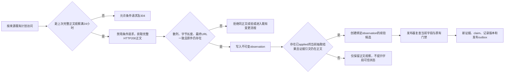

# 官方正文自动复核与证据续验审查 — 2026-09-16

## 结论与当前状态

本轮修复了无人值守更新中的一个实质缺口：官方正文长期不变时，抓取任务虽然持续成功，字段证据却一直停留在第一次抓取的日期，最终因 `max_age_days` 到期变为过期资料。

现在，可证明正文未变化的已接受字段能够形成新的观察凭据，再通过原有发布门禁生成新证据、声明、记录版本和发布任务。历史快照保持原始抓取时间。该能力已部署到采集和发布 Worker；**尚未取得部署后的真实远端复核凭据，不能据此宣称某条线上资料已完成续验或网站已更新。**

| 部署项 | 本任务主代理记录的结果 |
| --- | --- |
| Pipeline D1 `0018_source_revalidation_observations.sql` | 已成功应用，执行 11 条命令 |
| ingestion Worker | `63eedf54-15fe-493b-9ac3-93711c59e492` |
| publisher Worker | `a9bb1368-aeb8-4078-a567-4281c0da8b25` |
| 部署后远端 observation → candidate → publication 运行证明 | 待真实计划采集触发并核对 |

本审查覆盖本轮“相同正文的字段复核”实现，不代表整个目录、所有来源类型和网站发布链已经完全无人值守。

## 原因：正文版本与观察时间被混在一起

旧链路使用 `hash(sourceId:rawSha256)` 标识快照，数据库同时约束同一来源与正文散列唯一。`INSERT OR IGNORE` 保留快照首次 `fetched_at`，符合历史证据不可变的要求。

但两个快速返回分支只记录了任务成功：

- HTTP 304：更新来源 `last_checked_at`、`last_success_at` 和任务状态。
- 完整响应正文的散列与旧正文一致：同样直接记录 `raw-duplicate` 后返回。

发布器从旧快照的 `fetched_at` 计算 `verified_at` 与 `review_after`。因此，提高调度频率、重新运行相同抽取器，或仅去掉快速返回，都不能正确生成新的核验证据。直接改写历史快照日期则会破坏证据记录。

## 设计与数据流



**24 小时是同正文复核的最小间隔，不是所有来源的新抓取周期。** 来源继续使用已有 `schedule`。下一次计划访问时，若距原快照或最近观察已满 24 小时，才强制获取完整正文。仅收到 304 的到期复核会作为可重试失败处理，不延长字段有效期。

### 采集端

实现位于 [source-observations.ts](../../workers/ingestion/src/source-observations.ts) 和 [pipeline.ts](../../workers/ingestion/src/pipeline.ts)。

1. 仅接受支持文本解析的完整 HTTP 200 响应；304、206 和错误响应不生成续验凭据。
2. 重新计算下载正文 SHA-256，核对来源、快照、长度及最终 URL。来源当前散列必须仍指向该快照。
3. 确认对应 R2 原始正文对象仍存在。
4. 写入本次 `observed_at` 和正文散列。新下载的字节与现有不可变原件相同，凭据引用该原件。
5. 只选取已通过规则或双模型门禁且已实际 `applied` 的历史候选；抽取指纹必须与当前配置匹配。
6. 在本次正文中再次定位原字段证据引文，包括双模型的第二份引文。找不到引文时，不生成该续验候选。
7. 新候选采用独立、确定性 ID，复制原抽取事实与不可变抽取来源，明确绑定本次观察。

同一正文已经逐字节证明未变，沿用已接受抽取结果不需要重新支付双模型调用费用。正文或抽取配置变化仍进入既有抽取与校验流程。每种抽取指纹最多选择一个已接受结果，避免历史续验链不断复制出重复候选。

### 发布端

实现位于 [promoter.ts](../../workers/publisher/src/promoter.ts)。续验候选继续执行已有来源、模式、指纹、关键字段双模型一致性和字段类型校验，并增加以下约束：

- 续验候选必须携带有效观察凭据；正文证明、时间、长度、散列和最终 URL 必须一致。
- 当前字段及其声明都必须仍为 `accepted`，且值与本次候选一致。
- 不覆盖 `withheld` 字段、已变化的值、带冲突证据的字段，或存在未解决警告/阻断异常的记录。
- 观察时间必须真实推进当前字段的证据时间，不能倒退或取未来时间。
- 提交发布事务时再次确认来源仍启用且散列未变化，避免检查后到提交前发生来源变化。

通过检查后，发布器创建新的 `source_fetches`、`source_fragments`、`claims`、`record_versions`、`publication_jobs` 和 `outbox_events`。新字段的 `verified_at` 来自观察时间，`review_after` 仍按原字段 `max_age_days` 计算。旧声明按既有机制保留为 superseded，旧快照 `fetched_at` 不变。

## 证据迁移与回滚方式

[0018 迁移](../../infra/d1/pipeline/migrations/0018_source_revalidation_observations.sql) 仅新增表、索引与触发器：

| 结构 | 职责 |
| --- | --- |
| `ingestion_source_observations` | 保存每次完整正文复核的时间、任务、来源、快照、散列、长度、最终 URL 与证明类型 |
| `ingestion_candidate_observations` | 绑定新续验候选、观察凭据与原已接受候选 |
| 不可变与匹配触发器 | 拒绝更写/删除凭据，阻止错误快照绑定，并在发布事务提交时复查来源 |

没有迁移旧 `verified_at`，没有重写历史快照，也没有把旧任务成功时间当作复核时间。迁移必须先于新版 ingestion/publisher 部署。运行代码出现问题时，可回滚 Worker 版本并保留新增表与凭据；不需要删除已形成的审计历史。

## 验证证据

执行：

```text
node node_modules/tsx/dist/cli.mjs --test workers/publisher/tests/*.test.ts workers/ingestion/tests/*.test.ts
node node_modules/typescript/bin/tsc --noEmit --incremental false
```

- ingestion 与 publisher 两组 Worker 共 **101/101 测试通过**；该总数同时包含现有回归、来源绑定以及本轮新增测试，不能表述为“新增 101 个续验测试”。
- 本轮关键证据、发布事务和迁移约束测试使用 Node 的真实内存 SQLite，实际执行 SQL 与触发器，不以模拟返回值代替数据库行为。
- 全局 TypeScript 检查通过。
- 本轮修改文件的 ESLint 检查通过。
- `git diff --check` 无错误。

### 真实 SQLite 验证的关键情形

| 场景 | 结果 |
| --- | --- |
| 7 月 20 日首次证据，在 9 月 16 日获取相同完整正文 | 产生新凭据和发布任务；`verified_at` 为 9 月 16 日，30 天字段 `review_after` 为 10 月 16 日；原快照仍为 7 月 20 日 |
| 重复执行同一观察或发布 | 不重复创建声明、记录版本或发布任务 |
| 24 小时内访问 / 满 24 小时访问 | 前者允许条件请求，后者去掉条件请求头并要求完整正文 |
| 到期访问仅返回 304 | 不生成凭据，不刷新证据日期，保留可重试失败 |
| 206、错误响应、不同正文、伪造散列 | 拒绝续验或迁移触发器阻断写入 |
| 引文不在正文 / 抽取指纹过期 | 不生成续验候选，不刷新字段日期 |
| R2 原件丢失 / 续验候选缺凭据 | 拒绝续验或隔离候选 |
| 当前字段已变化、withheld、带冲突证据或来源正文已变化 | 隔离续验候选，不产生新的发布任务 |
| 尝试更新或删除 observation | 数据库不可变触发器拒绝 |

相关测试位于 [promoter.sqlite.test.ts](../../workers/publisher/tests/promoter.sqlite.test.ts) 与 [entity-persistence-resilience.test.ts](../../workers/ingestion/tests/entity-persistence-resilience.test.ts)。

## 明确边界与后续运行证明

1. **PDF、扫描件及其他二进制文档：** 尚未接入同正文续验。需要原文件与转换正文之间可复核的派生证据关系，再考虑续验；本轮不会以旧转换文本单独刷新日期。
2. **浏览器渲染来源：** 本轮续验要求明确的完整 HTTP 200 正文证明；浏览器渲染结果尚未提供等价凭据，未自动纳入。
3. **独立实体身份字段：** `entity-materializer` 自身的实体候选有独立快照及身份约束，其同正文续验尚未接入。不能把 publisher 字段续验覆盖等同于所有 program/scholarship 身份都已续验。
4. **未接受或冲突资料：** 观察凭据只说明重新获取了同一官方正文。没有已接受候选、可信字段映射或合格引文时，可以有 observation 而没有任何字段更新。
5. **远端效果：** 部署成功只证明代码与数据库结构就绪。须等待真实调度产生 observation，继续追踪绑定候选的 promotion、发布任务与公开网站版本，才能确认某次更新抵达用户。
6. **网站目录完整性：** 新 outbox 仍须经过既有发布、目录完整性和 D1/JSON 兼容门禁。本轮不切换网站数据后端，不允许不完整 D1 替换现有完整 JSON 目录。

后续核对必须依次区分“抓取完成”“正文已复核”“字段已接受”“目录已发布”和“网站已采用该目录”。任一中间步骤成功，都不能替代最后一步的公开版本验证。
