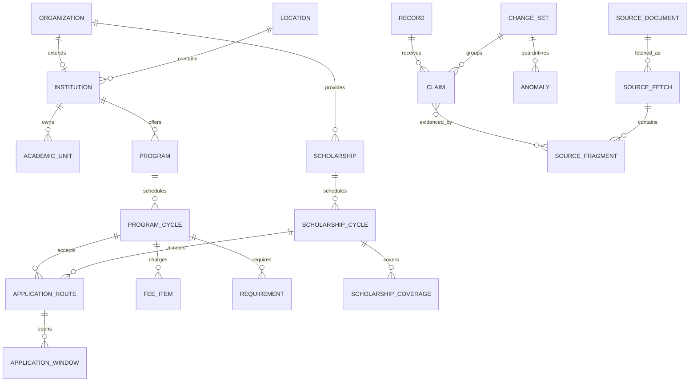

# Cloudflare D1 database schema

StudyInChina uses two Cloudflare D1 databases with different trust and workload boundaries:

| Database | Responsibility | Public request access |
|---|---|---|
| `pipeline` | Normalized working catalogue, source fetches, field claims, automatic validation and quarantine, audit, and publication jobs | Never |
| `catalog` | Immutable, release-scoped public projection and FTS5 search index | Only through `current_*` views |

There are deliberately no cross-database foreign keys. Stable text IDs, the pipeline publication job, the catalog release checksum, and the six release counts connect the databases. Raw HTML and PDFs belong in object storage; D1 stores their URI, digest, retrieval metadata, and small evidence fragments.

The SQL uses SQLite types, `CHECK` constraints, partial indexes, foreign keys, JSON functions, triggers, and FTS5 supported by D1. It does not depend on PostgreSQL schemas, enums, arrays, `NUMERIC`, stored procedures, or cross-database joins.

## Entity model



### Evergreen records and cycles

`programs` and `scholarships` describe stable schemes. Dates, application routes, fees, eligibility, and scholarship coverage belong to `program_cycles` or `scholarship_cycles` and their child records. A new academic year creates a new cycle; it never overwrites the previous cycle.

Program types are:

- `degree`, with a required `bachelor`, `master`, or `doctorate` level;
- `language`;
- `foundation`;
- `exchange`;
- `visiting`;
- `short_term`; and
- `other`.

An exchange, visiting, or short-term program enters `current_programs` only when an announced, visible cycle has an official application route whose `access_mode` is `public_individual` or `both`. Nomination-only records may remain in the pipeline but are not publicly discoverable.

### Money and dates

Money is stored as an integer minor-unit amount plus `currency_code` and `currency_exponent`. This avoids floating-point and JavaScript precision surprises while supporting currencies with different decimal exponents. Unknown money is `NULL`; zero means an official zero amount.

Official calendar dates use ISO `YYYY-MM-DD` text and SQLite `date()` validation. Operational timestamps use ISO text in UTC. Application state is derived at query time from the safe public field values; `open`, `upcoming`, and `closed` are not persisted.

## Pipeline database

Apply the pipeline migrations in filename order:

1. `infra/d1/pipeline/migrations/0001_domain.sql`
2. `infra/d1/pipeline/migrations/0002_evidence_workflow.sql`
3. `infra/d1/pipeline/migrations/0003_indexes_guards.sql`
4. `infra/d1/pipeline/migrations/0004_worker_runtime.sql`
5. `infra/d1/pipeline/migrations/0005_domain_throttle.sql`
6. `infra/d1/pipeline/migrations/0006_candidate_provenance_promotion.sql`
7. `infra/d1/pipeline/migrations/0007_snapshot_derivatives.sql`
8. `infra/d1/pipeline/migrations/0008_release_builder_contract.sql`
9. `infra/d1/pipeline/migrations/0009_entity_discovery_registry.sql`

### Domain records

`records` is the identity and workflow registry. Its `id` is an internal stable ID, while `public_id` is the immutable ID exported to the catalog/API. `record_slugs` preserves old route slugs.

The normalized domain tables cover organizations, official domains, geography, institutions, campuses, academic units, programs, teaching languages, disciplines, program cycles, application routes/windows, fees, requirements, required documents, scholarships, scholarship cycles, coverage, and explicit scholarship scopes.

`scholarship_cycles` uses `all`, `listed`, or `unknown` for each scope dimension. This avoids the legacy ambiguity where an empty array could mean either “all” or “not researched.” Catalog releases do not publish an `unknown` scope.

### Evidence and field provenance

The evidence chain is append-oriented:

1. `source_documents` registers the canonical URL and authority.
2. `source_fetches` records every retrieval result and immutable artifact digest.
3. `source_fragments` locates the exact HTML, JSON, PDF, OCR, or extracted evidence.
4. `claims` stores a typed candidate for one `record + field_path + locale`.
5. `claim_evidence` links a claim to one or more fragments.
6. `canonical_fields` points at the currently accepted claim and its review date.
7. `record_versions` preserves the complete applied before/after state.

A database trigger rejects promotion of a claim to `accepted` unless it has evidence from an official primary or secondary source. Claims must be inserted as candidates, evidence attached, validation completed, and only then promoted.

Pipeline `canonical_fields.field_status` is internal workflow state:

- `accepted`
- `unknown`
- `withheld`
- `expired`

It is not the public API `FactStatus` and must not be copied verbatim into a release.

### Workflow and audit

The ingestion path is:

```text
crawl_targets
  -> source_fetches / ingestion_runs
  -> claims
  -> change_sets
  -> deterministic validation
  -> anomalies / quarantine
  -> canonical_fields / record_versions
  -> publication_jobs / outbox_events
```

An ingestion identity cannot update canonical data directly. A blocker candidate is quarantined and cannot enter canonical fields or a public release. A later clean, automatically validated candidate may supersede it. `audit_log` records system, worker, migration, and release actions.

`ingestion_sources`, `ingestion_jobs`, `ingestion_snapshots`, `ingestion_candidates`, and `ingestion_robots_cache` are the Worker-facing runtime contract. Jobs move through queued, running, retry, and terminal states; candidate rows are automatically classified as `validated` or `quarantined` by deterministic rule and dual-extractor gates. Runtime snapshots retain artifact digests and URIs rather than raw payloads.

### Directory discovery and catalogue reconciliation

Official directory pages can contain hundreds of programmes or scholarships. The discovery layer preserves that one-to-many shape without weakening the canonical evidence gates:

1. `source_discoveries` records official links found in an immutable ingestion snapshot and tracks whether each link becomes a registered crawl source.
2. `extracted_entity_candidates` stores one immutable, source-backed candidate per entity and snapshot. Facts are an object, evidence is a non-empty array, and the normalized candidate payload has a SHA-256 digest.
3. `entity_registry` deduplicates recurring candidates into a stable institution-scoped identity and optionally binds that identity to a canonical record of the same kind.
4. `catalog_reconciliation_items` accounts for every official directory item as pending, published, unavailable for individual application, discontinued, officially absent, or unparseable.

Only the existing canonical claim, anomaly, promotion, and release workflow can make a registered entity public. Discovery or reconciliation status alone never bypasses those gates.

## Catalog database

Apply the catalog migrations in filename order:

1. `infra/d1/catalog/migrations/0001_release_core.sql`
2. `infra/d1/catalog/migrations/0002_programs_scholarships.sql`
3. `infra/d1/catalog/migrations/0003_search_views.sql`
4. `infra/d1/catalog/migrations/0004_atomic_release_cutover.sql`

Every catalog domain row includes `release_id`. A release is an immutable public snapshot. Building a new release does not affect readers because all `current_*` views start from the singleton `release_pointer` and require its target release to be `active`.

### Release contract

`catalog_releases` stores these explicit API fields:

- `data_date`: the source data date as `YYYY-MM-DD`;
- `generated_at`: the ISO generation timestamp;
- `data_version` and `schema_version`;
- `content_sha256`, the SHA-256 of the exact UTF-8 compatibility-envelope bytes uploaded to R2;
- `source_pipeline_run_id`; and
- `counts_json` containing the six established contract names: `sources`, `cities`, `universities`, `programs`, `admissionCycles`, and `scholarships`.

Consumers must never infer `dataDate` from a release ID or operational `created_at` timestamp.

Publish a release in this order:

1. Insert a `building` release.
2. Load its records, localized content, source summaries, field statuses, and search documents.
3. Run count, relationship, gate, checksum, and FTS checks.
4. Mark it `ready`.
5. Insert one row into `release_activation_requests`. Its SQLite trigger verifies that the release is `ready` and has `validated_at`, matches the expected R2-envelope checksum and metadata counts, and that the six physical row counts agree. The same trigger then retires the previous release, activates the new release, updates `release_pointer`, and writes audit rows.
6. Keep at least the previous release for rollback. Export older snapshots before purging their release rows.

The activation request `INSERT` and every trigger statement form one SQLite transaction. Any failed validation or count check aborts the statement and leaves the previous pointer and active release unchanged. Reusing the deterministic request ID makes release imports idempotent. The deploy script hashes the envelope file before uploading it to R2; D1 activation verifies the same hash against the immutable release row. The partial unique index allows only one `active` release. Pointer triggers reject a target that is not active and prevent deleting the singleton pointer.

### Record gate versus field gate

These gates are intentionally independent:

- `current_catalog_records` requires only an active release and `gate_status = 'publishable'`.
- A record becomes `withheld` only when its identity or official-source authority is uncertain. Record `review_after` does not automatically remove its entry.
- `current_record_fields` returns only public `known` facts whose `review_after` has not passed.
- A stale or conflicting fee, deadline, duration, requirement, or coverage value becomes `NULL`; it does not remove its parent university, program, or scholarship.
- The release builder uses `required_for_publish` when deciding `gate_status`; the public record view does not recompute record visibility from every field row.

Public domain views explicitly mask dynamic columns unless a matching current field exists. The release builder must use the column name as `field_path`, for example `duration_min`, `opens_on`, `amount_min_minor`, `coverage_mode`, or `institution_scope`.

### Public `FactStatus`

`record_field_status.field_status` exactly matches the public API contract:

| Public `FactStatus` | `value_json` | Meaning |
|---|---|---|
| `known` | Required | A current value accepted from official evidence |
| `officially_not_announced` | `NULL` | The matching official source explicitly has not announced it |
| `not_applicable` | `NULL` | The fact does not apply to this record |
| `source_unavailable` | `NULL` | The required official source cannot currently support a value |
| `conflict` | `NULL` | Applicable official sources disagree |
| `stale` | `NULL` | The accepted evidence has passed its review horizon |

The release builder maps pipeline state and anomaly reason explicitly:

| Pipeline condition | Catalog `FactStatus` |
|---|---|
| Accepted official claim, still current | `known` |
| Official page says not yet announced | `officially_not_announced` |
| Validated as inapplicable | `not_applicable` |
| Official source unavailable and no current accepted claim | `source_unavailable` |
| Open official-source conflict | `conflict` |
| Accepted claim past `review_after` | `stale` |

There is no generic public `unknown`, `accepted`, `withheld`, or `expired` status. Non-`known` facts are constrained to `value_json IS NULL`.

### Search

`search_documents` contains release- and locale-scoped text. External-content `search_fts` is synchronized by insert/update/delete triggers using FTS5's Unicode tokenizer.

Always join FTS results to `current_search_documents` so retired or withheld releases cannot appear:

```sql
SELECT documents.record_id, documents.record_kind, documents.title
FROM search_fts
JOIN current_search_documents AS documents
  ON documents.search_rowid = search_fts.rowid
WHERE search_fts MATCH ?
ORDER BY bm25(search_fts)
LIMIT ?;
```

D1 supports FTS5, but D1 export cannot export virtual tables. Recreate `search_fts` and run its `rebuild` command after restoring ordinary tables.

## Migration and local verification

The files are safe to execute repeatedly against a disposable local SQLite/D1 database: tables, indexes, triggers, and FTS objects use `IF NOT EXISTS`; the singleton pointer uses `INSERT OR IGNORE`; public views are recreated deterministically.

With Wrangler bindings named `PIPELINE_DB` and `CATALOG_DB` and each binding configured with its matching migration directory:

```text
wrangler d1 migrations apply PIPELINE_DB --local
wrangler d1 migrations apply CATALOG_DB --local
```

For a scratch database, execute each SQL file in lexical order twice, then check:

```sql
PRAGMA foreign_key_check;
PRAGMA integrity_check;
```

The second application must succeed, `foreign_key_check` must return no rows, and `integrity_check` must return `ok`. Also verify these behavioral failures/successes:

- an accepted pipeline claim without official evidence is rejected;
- a release pointer cannot target a non-active release;
- a non-`known` FactStatus cannot carry `value_json`;
- a stale field disappears from `current_record_fields` while its parent remains in `current_catalog_records`; and
- inserting/updating/deleting `search_documents` changes FTS5 results.

References:

- [Cloudflare D1 migrations](https://developers.cloudflare.com/d1/reference/migrations/)
- [Cloudflare D1 foreign keys](https://developers.cloudflare.com/d1/sql-api/foreign-keys/)
- [Cloudflare D1 SQL and FTS5 support](https://developers.cloudflare.com/d1/sql-api/sql-statements/)
