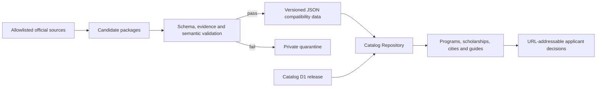

# Catalog depth and experience v3

**Date:** 2026-08-08
**Status:** implemented release candidate
**Scope:** verified catalogue depth, applicant-facing discovery, city and guide experience, and production-operability gates

## 1. Product goal and current stage

Study in China Atlas already has a broad national catalogue and a working evidence-first publication model. The next constraint is no longer raw record count: applicants need to find a useful option quickly, understand whether the facts are current, and leave through a trustworthy official route. At the same time, maintainers need backup and deployment workflows whose green status proves that the operation actually happened.

This release therefore treats the website and data platform as one system:

- deepen sparse university coverage with representative, individually applicable international-student programs;
- turn filters and cards into a decision workflow rather than a long static catalogue;
- make cities and guides useful exploration surfaces;
- keep JSON, D1 and the public API behaviorally equivalent;
- fail closed when backup or stable-alias credentials are unavailable.

## 2. Alternatives considered

### A. Count-only expansion

Import every discovered program and optimize for a larger headline number. This is fast, but it recreates thin schools, accepts weak evidence and makes maintenance cost grow faster than applicant value. Rejected.

### B. Visual-only redesign

Modernize the landing pages without changing data depth or operational guarantees. This improves first impressions but leaves the central trust and usefulness problems intact. Rejected.

### C. Balanced evidence-first increment

Publish a smaller verified data wave, add decision-oriented discovery, and harden the release path in the same change. This creates less headline growth than A, but every layer moves together and remains testable. Selected.

## 3. Architecture and data flow

The Repository boundary remains important: pages ask for catalogue capabilities, not a particular storage engine. The same filter is implemented in the JSON repository, compatibility API and D1 SQL API, then locked with cross-backend tests. That prevents a later D1 cutover from silently changing public behavior.

## 4. Data-depth contract

The sparse-school wave follows four publication rules:

1. An official HTTPS university or government page must establish record identity.
2. The program must be represented as available to international students; group-only routes are excluded.
3. Historical fees may be retained only as explicit reference facts. They cannot be presented as a current-cycle amount.
4. A missing opening or deadline remains `not-announced`; no date is inferred from neighboring years.

The intended unit of progress is a complete representative package, not an isolated row: 3–5 useful programs per university where official evidence permits, plus an application entry point and scholarship check.

## 5. Applicant experience decisions

### Navigation

The primary navigation contains the five discovery surfaces. Saved items are a separate shortlist action because they are a personal workflow, not a catalogue category. This reduces header crowding while keeping saved records one click away.

### Linked-scholarship filter

The program catalogue exposes **Linked scholarship**, not **Scholarship available**. A relationship only means an official scholarship record names the program or university; final eligibility can still depend on degree, nationality and cycle. The wording prevents the interface from promising funding it cannot prove.

### Cities

The city explorer uses one source of truth for a geographical constellation and an accessible directory view. Search, region filtering and sorting are URL-independent client controls over already-loaded public city summaries. No unapproved map tiles or geographic outline are introduced.

### Guides

Flagship guides use stable section anchors, a table of contents, official sources, FAQs and related discovery links. Structured data is generated from the same guide model as visible content so metadata cannot drift from the page.

## 6. Performance and scalability

The initial D1 scholarship filter used a correlated JSON scan for every program. Its cost grew approximately with programs multiplied by scholarship scopes. The final query builds two uncorrelated scope sets—program IDs and institution IDs—then performs membership checks. This keeps the expensive JSON expansion independent of the number of candidate program rows.

Catalogue pages remain server-rendered, use cursor pagination and preserve filters in the URL. No page request downloads the complete catalogue bundle when the D1 backend is active.

## 7. Reliability and security

- Backup credential validation runs before dependency installation and reports missing secret **names**, never values.
- Both remote D1 resources must pass read-only preflight before export begins.
- A failed backup writes an explicit RPO failure summary.
- A current-main Vercel deployment cannot report successful stable promotion when `VERCEL_TOKEN` is absent.
- Non-current deployment events remain legitimate no-ops, preventing stale deployments from moving the alias.
- Website content is treated as untrusted input; this release does not broaden crawler network or execution authority.

## 8. Verification strategy

The release is accepted only when all relevant layers pass:

- data schema, source ownership, relationship and duplicate validation;
- JSON, compatibility API and D1 filter contract tests;
- six-locale component and accessibility tests;
- backup and alias fail-closed workflow tests;
- TypeScript, ESLint, production build and Playwright critical paths;
- Worker tests and deployment dry-runs;
- exact-SHA Preview, main CI and production deployment verification.

## 9. Known limits and next increment

Linked scholarship does not yet prove applicant-specific eligibility. Full eligibility needs normalized scholarship cycles with degree, nationality, opening and closing scopes. Source Manifests and catalogue reconciliation also remain the main platform bottleneck. The next data increment should prioritize the remaining sparse universities, current admission cycles and scholarship-university gaps before expanding the school count again.
