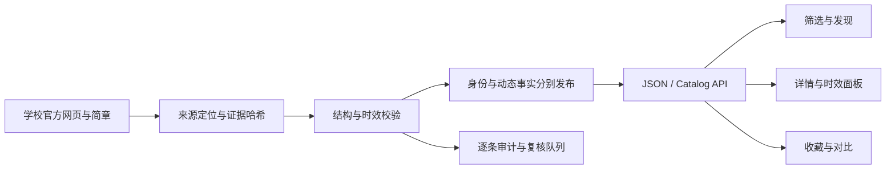

# 申请决策平台升级 — 2026-09-16

## 目标与现状

用户确认方向：筛选、对比、时间状态、官方证据一体化。平台已使用 Next.js、多语言组件、JSON 兼容目录、Cloudflare Pipeline/Catalog D1 与版本化发布基础设施。本次采用渐进重构，保留已工作的目录与证据模型。

首次全量审计覆盖 5,020 条记录：272 所高校、1,280 项目、860 周期、394 奖学金、62 城市、2,152 来源。身份存在不代表仍在招生，也不代表字段已完整核验。

## 架构与数据流

- 主数据保存真实 verifiedAt、reviewAfter 和状态；不以链接返回 200 或模型意见代替事实核验。
- API 按中国日历日期计算申请状态和复核状态。HTTP 缓存跨日失效，避免昨天开放的项目在今天继续被当作开放。
- 页面分别说明记录核验、周期复核与申请截止；对比使用与详情相同的字段状态。
- 可机器读取审计包含全记录、缺失字段、过期任务、来源引用与数据哈希，支持定期复现。

## ADR-001：渐进重构

**决策**：沿用当前 Next.js / Cloudflare 分层，修正统一事实语义并复用时效组件。

**理由**：现有发布门禁和多语言功能已成熟。重写整个栈会同时引入迁移、发布与数据一致性风险；仅换视觉又无法解决过期申请误导。

**代价**：JSON 和 D1 兼容路径仍需并行维护。新增迁移和针对性测试保证状态一致；生产 D1 切换仍需独立验证和回滚证据。

## ADR-002：官方证据决定事实

**决策**：对已超过复核日但没有新证据的 verified 记录执行 stale 降级；只更新实际打开并逐字段核对的记录日期。

**理由**：全量补齐不能靠继承上一学年、猜测或批量延长期限。确认不了的字段保留明确不确定状态。

**代价**：当前可行动项目数量可能较少。通过公开来源与复核队列给出可持续修复路径，而不是伪造完整率。

## ADR-003：申请状态与缓存共享时间边界

**决策**：截止优先于 rolling；只有截止日期时显示“日期已公布”，不推断已经开始；所有实现使用中国日历日。有效缓存时长不能跨越下一个中国零点。

**理由**：数据源可以稳定，但“今日是否可申请”会随时间变化。缓存标识还必须对应实际请求结果，不能只按 release ID 通用。

**代价**：零点附近缓存命中率降低；这是决策准确性所需的有限代价。

## 验收

1. 主数据 schema、引用完整性、来源登记、D1 迁移与数据维护校验通过。
2. 过期 verified 归零；保留真实核验日期和原始证据，记录前后变化。
3. 学校、项目、奖学金详情与对比展示统一时效语义；六种公开语言与移动端可用。
4. 依赖漏洞审计、类型、lint、单元测试、Workers 测试与生产构建通过。
5. 浏览器验证筛选、对比和官方证据路径；明确区分本地验证与生产发布。

## 后续运营重点

按审计任务优先处理仍可能申请但证据超期的记录，然后是失效的官方申请入口、费用/要求缺口及来源清单覆盖。一次 HTTP 扫描不计为逐字段复核，外部 AI 的候选不直接进入正式数据。
